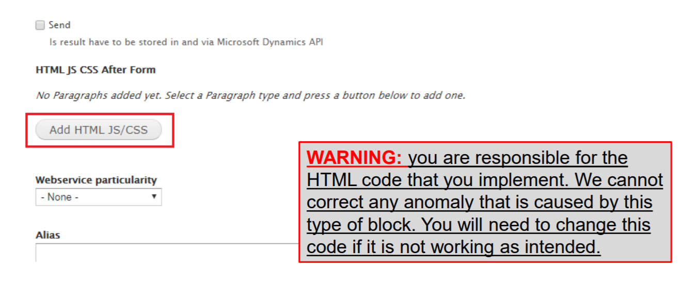
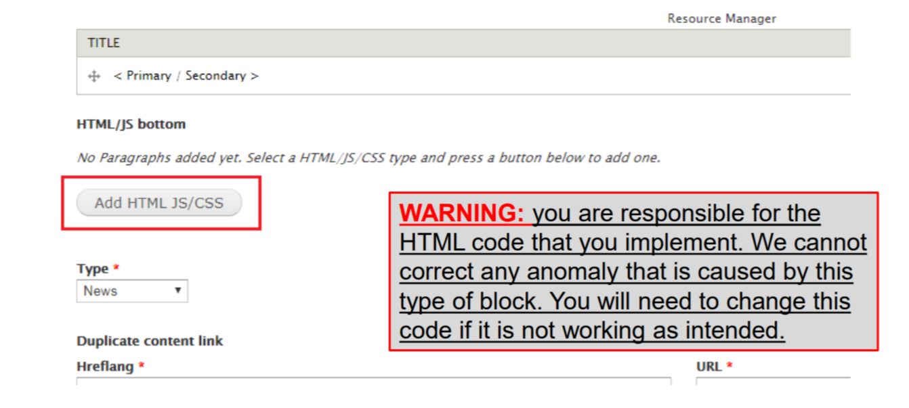
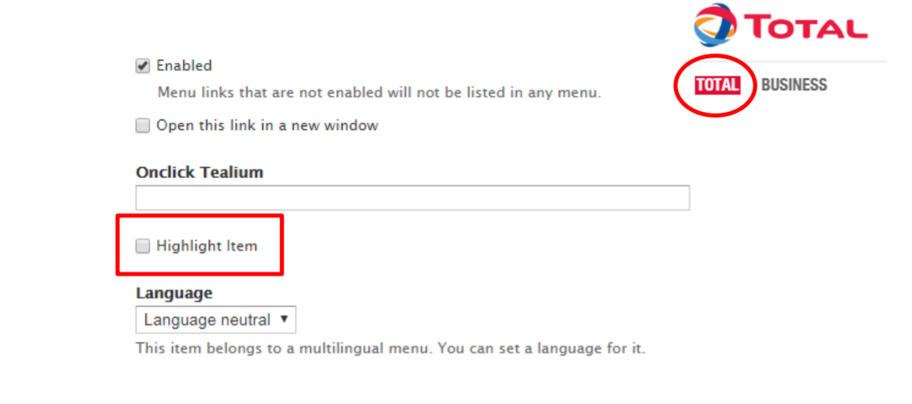

# TOTAL BACKEND TUTORIAL

### ADD HTML JS/CSS BLOCK IN WEBFORM

* On the Webforms page types, you can now add a custom HTML JS/CSS block that
allows you to add more display options.

* When you create or edit a Webform, you need to click on « Add HTML JS/CSS
code », then you need to type the name of the HTML block that you have created
earlier in the dedicated field that appeared.

### ADD HTML JS/CSS BLOCK IN NEWS

* On the News page types, you can now add a custom HTML JS/CSS block that allows
you to add more display options.

* When you create or edit a News, you need to click on « Add HTML JS/CSS code »,
then you need to type the name of the HTML block that you have created earlier in the
dedicated field that appeared.

### HIGHLIGHT A MENU ITEM

* You can now highlight a Menu item in red in the Main Menu. 

* To highlight a Menu item you need to go to :
**Structure > Menus > Main Menu > configure item** (for the element you want to highlight)

* Then you need to tick the box « Highlight Item » and save. 

 